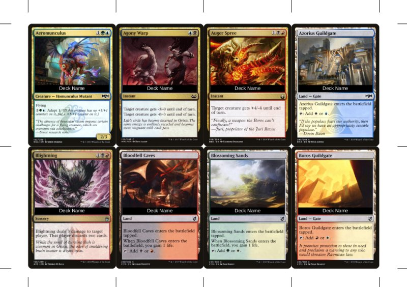

# mtg

_mtg_ is a library that helps manipulating [Magic: The Gathering](https://magic.wizards.com/en) decks.

## Overview

- [proxy-deck](#proxy-deck)
- [The Staples Binder Method](#the-staples-binder-method)

## proxy-deck

`proxy-deck` is a command line tool that can be used to create a proxy deck.

Given a `deck.txt` in the standard format for MTG decks:

```txt
1 Aeromunculus
1 Agony Warp
1 Auger Spree
1 Azorius Guildgate
1 Blightning
1 Bloodfell Caves
1 Blossoming Sands
1 Boros Guildgate
```

the command

```bash
proxy-deck deck.txt
```

will create a proxy `deck.pdf` with [scryfall](https://scryfall.com) images:


With the command

```bash
proxy-deck -name "Deck Name" deck.txt
```

a proxy `deck.pdf` can be created that will overlay the decks name:



which may come in handy when using [The Staples Binder Method](#the-staples-binder-method) to save some cash.

## The Staples Binder Method

The Staples Binder Method can be used to to save some cash while playing multiple decks within a format. With this method you will need at max 4 original copies of any given card in your collection. To reduce the amount of effort this method should only be used for cards that have a value greater than a few dollars.

- Put all decks in the same sleeves (brand/color).

- Keep the sleeved _staples_ in a binder.

- Proxy print the needed number of any given _staple_ with the decks name as an overlay.

- Cut out the _proxy_.

- Sleve up the _proxy_ together with a _basic land_.

- Keep the sleeved _proxy_ with the rest of the cards in the deck.

- Before the game pull out all _proxies_ and replace them with the original printings from the _Stapels Binder_.

- After the game replace all of the _staples_ in your deck with the _proxies_ that where pulled out before the game.

- __Tip__: The name of the deck is important if you want to always know where the original printing currently is. If you find a _proxy_ within your _Staples Binder_ the name will tell you where your original is located. In case you're trying to replace a _proxy_ from deck _A_ and find a _proxy_ of deck _B_ in your _Staples Binder_ you know that the original is currently located in deck _B_.

- __Tip__: In a casual setting and if your playgroup does not mind, you could skip replacing the _proxies_ to save some time and effort. In case you are double sleeving your cards you will not notice a difference in thickness between (_proxy + basic land + outer-sleeve_) and (_inner-sleeve + staple + outer-sleeve_).
